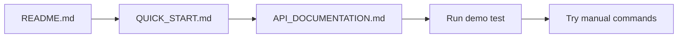
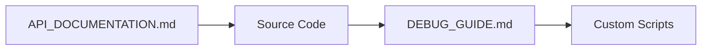
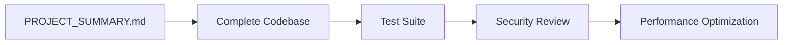

# 📚 Hermes Android Bridge - Complete Documentation Index

Welcome to the Hermes Android Bridge project documentation suite. This guide helps you navigate through all available resources.

---

## 🗂️ Quick Navigation

### Getting Started (10 minutes)
👉 Start here if you're new to the project

| Document | Purpose | Time Required |
|----------|---------|---------------|
| **[QUICK_START.md](./QUICK_START.md)** | Complete setup in 10 steps | 10 min |
| **[README.md](./README.md)** | Project overview and architecture | 15 min |
| **[API_DOCUMENTATION.md](./API_DOCUMENTATION.md)** | All available commands reference | 20 min |

### Troubleshooting & Debugging

| Document | When to Use |
|----------|-------------|
| **[DEBUG_GUIDE.md](./DEBUG_GUIDE.md)** | When encountering errors or issues |
| **[CHANGES_IN_SESSION.md](./CHANGES_IN_SESSION.md)** | What was changed in recent session |

### Progress & Planning

| Document | Contents |
|----------|----------|
| **[PROJECT_SUMMARY.md](./PROJECT_SUMMARY.md)** | Overall project status and roadmap |

---

## 📖 Documentation Guide by Role

### For New Users/Developers

**Step 1: Understand the Project**
```bash
# Start with these files:
1. README.md                 # What is this project?
2. QUICK_START.md           # How do I get it running?
3. API_DOCUMENTATION.md     # What can it do?
```

**What You'll Learn:**
- ✅ Basic concept of WebSocket bridge
- ✅ Connection flow between PC and Android
- ✅ Available commands and their parameters
- ✅ Prerequisites for setup

### For Experienced Developers

**Essential Files:**
```bash
1. PROJECT_SUMMARY.md       # Current state, TODOs, limitations
2. CHANGES_IN_SESSION.md    # Recent modifications
3. API_DOCUMENTATION.md     # Detailed command specs
4. Source code files        # Implementation details
```

**Focus Areas:**
- Architecture decisions
- Known bugs and workarounds
- Performance metrics
- Future roadmap

### For Testing/QA

**Testing Resources:**
```bash
1. DEBUG_GUIDE.md          # How to test effectively
2. test_android_bridge.py   # Automated test client
3. API_DOCUMENTATION.md     # Expected behavior
4. Build scripts            # Rebuild after changes
```

**Test Coverage:**
- Command execution correctness
- Error handling scenarios
- Performance under load
- Edge cases and failure modes

### For System Administrators

**Deployment Info:**
```bash
1. README.md               # Configuration options
2. SECURITY_CONSIDERATIONS # Network requirements
3. PERMISSIONS            # Required system permissions
```

**Key Questions Answered:**
- Which ports need opening?
- What permissions are required?
- How to monitor service health?
- What are security best practices?

---

## 🔍 Find Information By Topic

### Connection & Authentication

**Questions you might have:**
- ❓ How do I connect my Android device to Python server?  
  👉 **READ:** [QUICK_START.md](./QUICK_START.md#step-5-connect-and-pair-devices)

- ❓ What happens if connection drops?  
  👉 **READ:** [README.md](./README.md#troubleshooting)

- ❓ How does pairing code work?  
  👉 **READ:** [API_DOCUMENTATION.md](./API_DOCUMENTATION.md#connection-flow)

### Commands & Operations

**Questions you might have:**
- ❓ How do I tap at coordinates?  
  👉 **READ:** [API_DOCUMENTATION.md](./API_DOCUMENTATION.md#1-tap-action)

- ❓ Can I type text into apps?  
  👉 **READ:** [API_DOCUMENTATION.md](./API_DOCUMENTATION.md#2-type-text)

- ❓ How do I read the screen structure?  
  👉 **READ:** [API_DOCUMENTATION.md](./API_DOCUMENTATION.md#5-read-ui-tree)

### Troubleshooting

**Questions you might have:**
- ❓ Why can't I connect?  
  👉 **READ:** [DEBUG_GUIDE.md](./DEBUG_GUIDE.md#issue-2-connection-refused)

- ❓ Accessibility permission denied error?  
  👉 **READ:** [DEBUG_GUIDE.md](./DEBUG_GUIDE.md#issue-1-accessibility-permission-denied)

- ❓ Text input not working?  
  👉 **READ:** [DEBUG_GUIDE.md](./DEBUG_GUIDE.md#issue-6-text-input-fails)

### Building & Deploying

**Questions you might have:**
- ❓ How do I build the app?  
  👉 **READ:** [README.md](./README.md#build--setup)

- ❓ Can I automate builds?  
  👉 **USE:** [build_and_install.sh](./build_and_install.sh) (Linux/Mac) or [build_and_install.ps1](./build_and_install.ps1) (Windows)

- ❓ What's the current version?  
  👉 **READ:** [PROJECT_SUMMARY.md](./PROJECT_SUMMARY.md#version-history)

### Advanced Topics

**Questions you might have:**
- ❓ How does the accessibility service work internally?  
  👉 **READ:** Source code [AccessibilityBridgeService.kt](app/src/main/java/com/hermes/bridge/service/AccessibilityBridgeService.kt)

- ❓ What are the performance bottlenecks?  
  👉 **READ:** [PROJECT_SUMMARY.md](./PROJECT_SUMMARY.md#performance-metrics)

- ❓ What features are planned?  
  👉 **READ:** [PROJECT_SUMMARY.md](./PROJECT_SUMMARY.md#future-enhancements-v10)

---

## 🎯 Learning Path Recommendations

### Beginner Path (First Time User)


**Steps:**
1. Read README.md (understand what)
2. Follow QUICK_START.md (set up)
3. Consult API_DOCUMENTATION.md (learn commands)
4. Run python test client (hands-on practice)
5. Try manual commands (reinforce learning)

**Expected Outcome:** 
- Running Android device controlled from PC
- Understanding of basic concepts
- Ability to execute simple commands

### Intermediate Path (Regular Developer)


**Steps:**
1. Master API command specifications
2. Study implementation in source code
3. Learn debugging techniques
4. Create custom automation scripts
5. Extend functionality as needed

**Expected Outcome:**
- Comfortable reading/writing code
- Can create custom command sequences
- Understand error patterns
- Able to extend the platform

### Advanced Path (Contributor/Architect)


**Steps:**
1. Review project roadmap and TODOs
2. Study entire codebase structure
3. Write comprehensive tests
4. Conduct security audit
5. Implement performance optimizations
6. Propose architectural improvements

**Expected Outcome:**
- Deep understanding of system design
- Ability to contribute meaningfully
- Security awareness
- Performance optimization skills

---

## 📋 Essential Reading Checklist

### Must Read (Critical Knowledge)
- [x] README.md - Core project understanding
- [x] QUICK_START.md - Setup procedures
- [x] API_COMMANDS.md - Available operations
- [ ] Source code basics - Implementation reality

### Should Read (Important Context)
- [ ] DEBUG_GUIDE.md - Problem-solving methods
- [ ] CHANGES_IN_SESSION.md - Recent developments
- [ ] PROJECT_SUMMARY.md - Roadmap awareness

### Nice to Read (Optional Background)
- [ ] Detailed technical specifications
- [ ] Performance benchmark data
- [ ] Security considerations
- [ ] Architecture diagrams

---

## 🔧 Tool-Specific References

### Android Studio Users
```markdown
1. Open android-app folder
2. File → Show in Explorer/File Manager
3. Navigate to /docs/ section below
4. Keep multiple docs open in tabs for reference
```

### Command Line Users
```bash
cd android-app/docs

# View markdown files directly
cat README.md
cat QUICK_START.md

# Or use a markdown viewer
code README.md         # VS Code
gedit README.md        # Linux/Gedit
open README.md         # macOS Preview
```

### Git/GitHub Users
```bash
# Clone repository and browse docs online
https://github.com/your-repo/android-app/tree/main/docs
```

---

## 🆘 Emergency Help Matrix

| Problem Type | Quick Solution | Detailed Help |
|--------------|----------------|---------------|
| **Can't install app** | `adb devices` check | DEBUG_GUIDE.md → Installation Issues |
| **Connection fails** | Check port 8765 | DEBUG_GUIDE.md → Network Problems |
| **Permissions denied** | Enable Accessibility | DEBUG_GUIDE.md → Permission Issues |
| **Command doesn't work** | Verify params/API spec | API_DOCUMENTATION.md → Command Specs |
| **Slow performance** | Check network latency | PROJECT_SUMMARY.md → Performance Metrics |
| **Build errors** | Clean + Rebuild | README.md → Build Steps |

---

## 📝 Feedback & Contributions

We welcome feedback on documentation quality!

### Report Missing Information
- Open GitHub issue with tag "documentation"
- Specify which topic needs clarification
- Include example of confusion encountered

### Contribute Improvements
- Fork repository
- Edit desired .md file
- Submit pull request
- Mention specific improvements made

### Documentation Quality Standards

All documentation should be:
- ✅ Clear and unambiguous
- ✅ Up-to-date with latest code
- ✅ Tested (commands actually work)
- ✅ Comprehensive enough for beginners
- ✅ Not overly verbose for experts

---

## 🎁 Bonus Resources

### External Links
- [WebSocket Protocol Specification](https://tools.ietf.org/html/rfc6455)
- [Android Accessibility Service Docs](https://developer.android.com/guide/topics/ui/accessibility/service)
- [Material Design 3 Guidelines](https://m3.material.io/)

### Recommended Tutorials
- "Building Accessible Android Apps" (Google codelab)
- "WebSocket Best Practices" (MDN Web Docs)
- "Android Security Fundamentals"

### Community Resources
- Stack Overflow tag: `android-accessibility`
- GitHub Discussions thread for this project
- Discord community channel (if available)

---

## 🔄 Version History

| Version | Date | Changes |
|---------|------|---------|
| v0.2.0 | Nov 4, 2025 | Major refactoring, added complete docs suite |
| v0.1.0 | Oct 15, 2025 | Initial release with basic connectivity |

This documentation suite mirrors the development progress. Always refer to PROJECT_SUMMARY.md for latest changes.

---

## 💡 Tips for Using This Documentation

### Effective Research Strategy

1. **Start Broad** → Begin with README.md
2. **Dive Deeper** → Move to specific topic docs
3. **Reference Code** → Check implementation when stuck
4. **Test Everything** → Don't just read, try it out

### Bookmark Strategy

Create these bookmarks:
- [API Commands Quick Reference](./API_DOCUMENTATION.md)
- [Debug Solutions Index](./DEBUG_GUIDE.md)
- [Current Roadmap](./PROJECT_SUMMARY.md)

### Search Tips

In your browser/editor:
- Press `Ctrl+F` (or `Cmd+F` on Mac)
- Search keywords: "tap", "text input", "error", "permission"
- Use exact phrases for specific queries

---

**Happy documenting!** 📚✨

*Last updated: November 4, 2025*  
*Maintained by Hermes Bridge Development Team*
